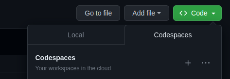

# LAD Accounting-Dash

Esta aplicação foi desenvolvida usando Python 3.10.12 e algumas de suas bibliotecas (Dash, Flask, Peewee e Pandas) com os objetivos de dinamizar o controle dos clusters e equipamentos do LAD, assim como demonstrar estatísticas que mostram a importância do laboratório como instrumento de produção científica e comercial da PUCRS.
## Executar no GitHub Codespaces
1. Abra a aba de Codespaces no repositório do [LAD Accounting](https://github.com/LAD-PUCRS/LAD_Accounting)

2. Você será redirecionado no terminal virtual do VS Code

3. Após carregar todo o script de inicialização, automático, uma porta será estabelecida no terminal do VS Code virtual
    > _Caso não inicialize de forma automática, digite `bash script.sh` no terminal_

4. Aparecerá um pop-up no terminal, clique em `abrir no browser` para abrir a aplicação.
    > _Caso o pop-up não apareça, procure a aba 'portas" no terminal e abra em uma nova guia._

## Executar localmente
### Requisitos

- [Python 3.7+](https://www.python.org/)
- [Dash 2.1.1](https://dash.plotly.com/) - `pip install dash`
- [Pandas 2.0](https://pandas.pydata.org/docs/getting_started/index.html) - `pip install pandas`
- [Dash-Bootstrap-Components](https://dash-bootstrap-components.opensource.faculty.ai/) - `pip install dash-bootstrap-components`
- [OpenpyXL](https://openpyxl.readthedocs.io/en/stable/) - `pip install openpyxl`
- [Flask 2.2](https://flask.palletsprojects.com/en/2.2.x/) - `pip install Flask`
- [Peewee](https://docs.peewee-orm.com/en/latest/peewee/installation.html) - `pip install peewee`

> #### Script pronto:
> Ao invés de instalar todas as bibliotecas manualmente, execute o seguinte comando para instalar todas as bibliotecas necessárias e executar a aplicação:
> 
> `bash script.sh`

### Executar

Após instalar as bibliotecas, acesse o diretório com as pastas/arquivos deste repositório na máquina local, digite o comando abaixo e aguarde o link para visualizar a aplicação:

`python3 app.py`

### Outras ferramentas e exemplos:
- [Modelo ER](https://user-images.githubusercontent.com/68079812/182753634-68ca3daf-ed7f-4059-b307-054247fde6da.jpg)
- [Bootstrap](https://getbootstrap.com/docs/5.2/getting-started/introduction/)
- [Dash](https://dash.plotly.com/)
- [Jinja](https://jinja.palletsprojects.com/en/3.1.x/templates/)
- [OpenpyXL](https://openpyxl.readthedocs.io/en/stable/) - `pip install openpyxl`
- [Exemplo de aplicação com Peewee e Flask](https://docs.peewee-orm.com/en/latest/peewee/example.html)
